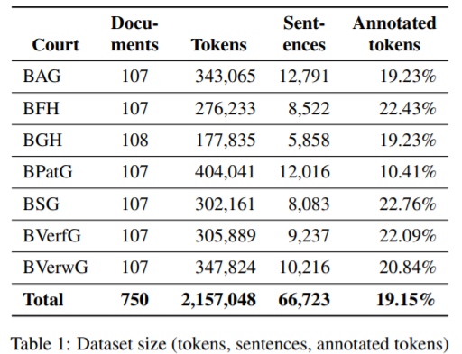
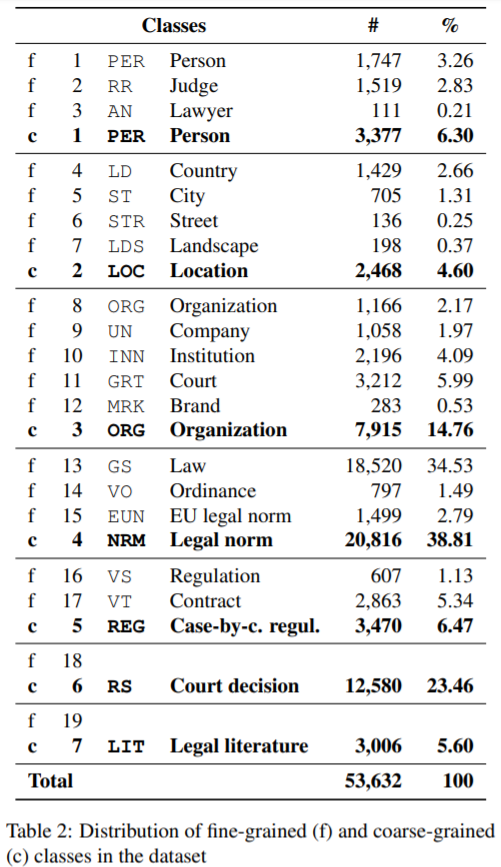
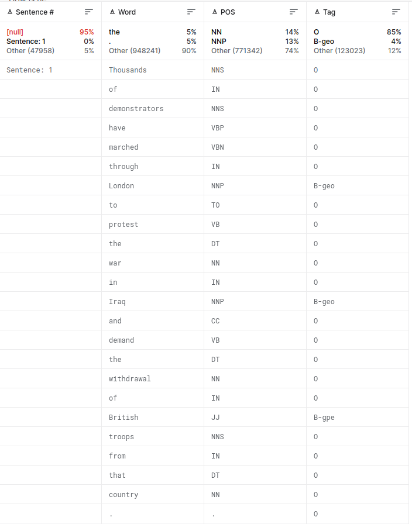

# datasets

## NER only
* ### 1. Fine-grained Named Entity Recognition in Legal Documents
    * Description: Court decisions from 2017 and 2018 were selected for the dataset, published online by the Federal Ministry of Justice and Consumer Protection. The documents originate from seven federal courts: Federal Labour Court (BAG), Federal Fiscal Court (BFH), Federal Court of Justice (BGH), Federal Patent Court (BPatG), Federal Social Court (BSG), Federal Constitutional Court (BVerfG) and Federal Administrative Court (BVerwG).
    * Project: https://github.com/elenanereiss/Legal-Entity-Recognition
    * Annotation Guidelines: https://raw.githubusercontent.com/elenanereiss/Legal-Entity-Recognition/master/docs/Annotationsrichtlinien.pdf
    * existing Bachelor thesis: https://raw.githubusercontent.com/elenanereiss/Legal-Entity-Recognition/master/docs/Leitner_LER_BA.pdf
    * data: https://huggingface.co/datasets/elenanereiss/german-ler
    * pros: human annotated
    * cons: named entities are anonymized eg. "Herr M. wurde am ..." anstelle von "Herr Mustermann wurde am ..."
    * 
    * 

* ### 2. Annotated Corpus from Named Entity Recognition
    * Description: Annotated Corpus for Named Entity Recognition using GMB(Groningen Meaning Bank) corpus for entity classification with enhanced and popular features by Natural Language Processing applied to the data set.
    * Source: https://www.kaggle.com/datasets/abhinavwalia95/entity-annotated-corpus
    * original data from GMB: https://gmb.let.rug.nl/data.php
    * entities:
        * geo = Geographical Entity
        * org = Organization
        * per = Person
        * gpe = Geopolitical Entity
        * tim = Time indicator
        * art = Artifact
        * eve = Event
        * nat = Natural Phenomenon
    * Total Words Count = 1354149
    * 

* ### 3. Tipp von V. (ehemals GMB Mitwirkender)
    * einige Datensätze enden in 404 (lange her), einige hinter Paywall, andere nicht immer rechtlich klar, wieder andere erfodern Anfrage wie z.b. i2b2, mittlerweile übernommen durch Harvard Medical School n2c2-nlp
    * Sammlung NER: https://github.com/juand-r/entity-recognition-datasets
        * vllt hiervon: https://www.clips.uantwerpen.be/conll2003/ner/

## NER und RE  (Relation)
### Rechtlich mir bis jetzt nicht immer klar, da Datensätze mit scripts von Servern geladen werden. Es existieren Licences die Tools zu nutzen (Free), aber was ist mit den Datensätzen...
* ### 4. SpERT: Span-based Entity and Relation Transformer 
    * original paper: https://arxiv.org/abs/1909.07755
    * code: https://github.com/lavis-nlp/spert
    * license: https://github.com/lavis-nlp/spert/blob/master/LICENSE
    * dataset : ade and conll04 (downloaded)

* ### 5. JointER: Joint Extraction of Entities and Relations Based on a Novel Decomposition Strategy
    * original paper: https://arxiv.org/abs/1909.04273
    * code: https://github.com/yubowen-ph/JointER
    * dataset: NYT-multi (downloaded)

* ### 6. JEREX: "Joint Entity-Level Relation Extractor"
    * original paper: https://arxiv.org/abs/2102.05980
    * code: https://github.com/lavis-nlp/jerex
    * license: https://github.com/lavis-nlp/spert/blob/master/LICENSE
    * dataset: docred and docred_joint (downloaded)
